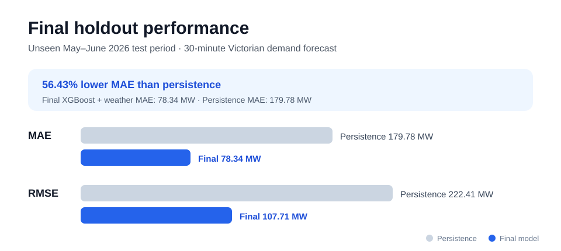
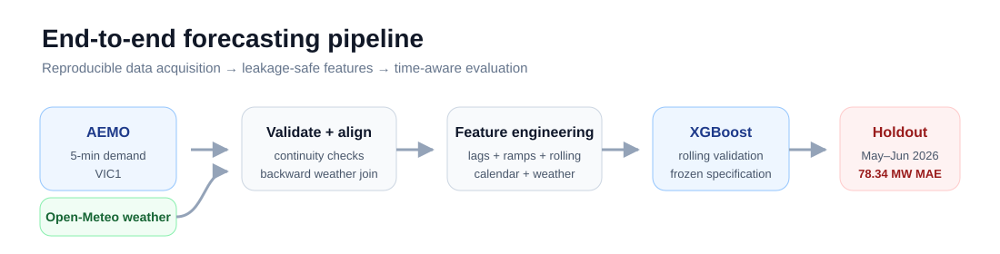
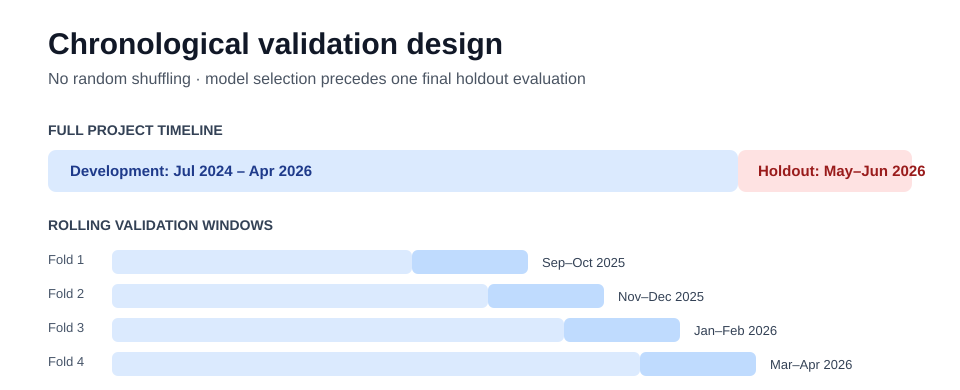

# Victorian NEM Demand Forecasting

[](https://github.com/SamatarIbrahim/nem-demand-forecasting/actions/workflows/ci.yml)


A leakage-aware, end-to-end forecasting project for **Victorian operational electricity demand 30 minutes ahead**, using AEMO market data, Melbourne weather, chronological validation, and XGBoost.

The emphasis is not just model accuracy: the repository demonstrates reproducible data acquisition, time-series validation, leakage-safe feature engineering, baseline discipline, model comparison, backtesting, testing, and CI.

**Start here:** [technical report](docs/technical-report.md) · [model card](MODEL_CARD.md) · [data dictionary](docs/data-dictionary.md) · [final evaluation notebook](notebooks/08_final_evaluation.ipynb)



## At a glance

| Item | Detail |
| --- | --- |
| Forecast target | Victorian `TOTALDEMAND` 30 minutes ahead |
| Demand data | AEMO `PRICE_AND_DEMAND`, `VIC1`, Jul 2024–Jun 2026 |
| Weather data | Open-Meteo hourly historical weather for Melbourne |
| Final model | XGBoost with demand dynamics, calendar context, historical lags, rolling statistics, and weather |
| Final holdout | May–Jun 2026, untouched during model/feature selection |
| Final MAE | **78.34 MW** |
| Final RMSE | **107.71 MW** |
| Improvement vs persistence | **56.43% lower MAE** |
| Median absolute error | **57.45 MW** |
| 90th percentile absolute error | **173.89 MW** |

> **Project status:** v1 modelling is complete. The final holdout has been opened and is no longer used for tuning. Any future model iteration should use a new out-of-time evaluation period rather than optimise against May–June 2026.

## What this project demonstrates

- **Time-series modelling discipline:** chronological splits, rolling validation, and a genuinely untouched final holdout.
- **Leakage awareness:** forecast features use only information available at forecast issue time; hourly weather is attached with a backward as-of join.
- **Baseline-first evaluation:** persistence, previous-day, previous-week, and linear-regression benchmarks are established before gradient boosting.
- **Feature reasoning:** recent demand trajectory, calendar context, historical lags, rolling statistics, and weather are tested rather than assumed useful.
- **Ablation and robustness checks:** feature groups are compared and weather is retained only after improving all four rolling validation folds.
- **Reproducible engineering:** data-build scripts, reusable package code, unit tests, machine-readable metrics, and GitHub Actions CI.

## Pipeline



The core workflow is deliberately reproducible: public source data are downloaded by scripts, validated, transformed into leakage-safe features, evaluated through chronological backtests, and finally tested on an untouched future period.

## Results

### Final holdout

On **17,568 five-minute forecasts** from May–June 2026:

| Metric | Persistence | Final XGBoost + weather |
| --- | ---: | ---: |
| MAE | 179.78 MW | **78.34 MW** |
| RMSE | 222.41 MW | **107.71 MW** |

The final model reduced holdout MAE by **56.43%** relative to persistence.

### Model development progression

On the March–April 2026 validation period, performance progressed from:

| Model | Validation MAE |
| --- | ---: |
| Persistence | 163.64 MW |
| Linear regression | 107.54 MW |
| XGBoost | 77.25 MW |
| XGBoost + weather | **75.90 MW** |

This progression is useful because each increase in complexity had to beat a previously established benchmark.

### Weather robustness

Weather improved forecast MAE in **4 of 4** rolling historical validation folds. Mean MAE fell from **88.11 MW to 85.93 MW**, with the largest gain in Jan–Feb 2026.

A public-holiday indicator was also tested and rejected after slightly worsening validation performance. The project keeps unsuccessful experiments visible rather than retaining features for narrative convenience.

## Validation design



Random train/test shuffling is never used. Model development used expanding historical training data with four validation windows:

- Sep–Oct 2025
- Nov–Dec 2025
- Jan–Feb 2026
- Mar–Apr 2026

The model specification was then frozen, retrained using all available pre-May data, and evaluated once on May–June 2026.

For a more explicit statement of intended use, assumptions, metrics, and limitations, see the [model card](MODEL_CARD.md).

## Data and time handling

**Demand:** monthly AEMO `PRICE_AND_DEMAND` files for Victoria (`VIC1`) at five-minute frequency. The build script automatically checks required columns, missing values, duplicate timestamps, region consistency, and five-minute continuity before saving the processed dataset.

**Weather:** hourly Open-Meteo historical weather for central Melbourne. Weather timestamps are converted to fixed AEST to align with AEMO market time, then merged backward so no demand row receives a future weather observation.

Raw and processed datasets are intentionally excluded from Git. The repository contains the code required to rebuild them. See the [data dictionary](docs/data-dictionary.md) for source and engineered field definitions.

## Repository map

```text
.
├── .github/workflows/ci.yml         # automated lint + test checks
├── docs/
│   ├── assets/                      # README figures
│   ├── data-dictionary.md           # source and engineered field definitions
│   └── technical-report.md          # reviewer-friendly analytical narrative
├── notebooks/                       # analysis from exploration to holdout evaluation
├── reports/
│   ├── README.md                    # reporting-artifact notes
│   └── final_metrics.json           # machine-readable headline metrics
├── scripts/
│   ├── build_dataset.py             # download, validate, and combine AEMO data
│   ├── build_weather.py             # download + save Melbourne weather
│   └── run_final_evaluation.py      # reproduce the frozen holdout evaluation
├── src/nem_demand_forecasting/
│   ├── data.py                      # AEMO acquisition/loading helpers
│   ├── features.py                  # leakage-safe feature engineering
│   ├── modeling.py                  # frozen model + evaluation helpers
│   ├── validation.py                # demand-series integrity checks
│   └── weather.py                   # weather acquisition helpers
├── tests/                           # unit tests for features, validation, and modelling
├── MODEL_CARD.md
├── pyproject.toml
└── uv.lock
```

## Notebook sequence

| Notebook | Purpose | Alternate renderer |
| --- | --- | --- |
| [`01_explore_demand.ipynb`](notebooks/01_explore_demand.ipynb) | one-month exploration and initial demand patterns | [nbviewer](https://nbviewer.org/github/SamatarIbrahim/nem-demand-forecasting/blob/main/notebooks/01_explore_demand.ipynb) |
| [`02_validate_historical_data.ipynb`](notebooks/02_validate_historical_data.ipynb) | structural validation of the two-year series | [nbviewer](https://nbviewer.org/github/SamatarIbrahim/nem-demand-forecasting/blob/main/notebooks/02_validate_historical_data.ipynb) |
| [`03_historical_patterns.ipynb`](notebooks/03_historical_patterns.ipynb) | seasonality, intraday profiles, and lag relationships | [nbviewer](https://nbviewer.org/github/SamatarIbrahim/nem-demand-forecasting/blob/main/notebooks/03_historical_patterns.ipynb) |
| [`04_baseline_models.ipynb`](notebooks/04_baseline_models.ipynb) | persistence and historical baselines | [nbviewer](https://nbviewer.org/github/SamatarIbrahim/nem-demand-forecasting/blob/main/notebooks/04_baseline_models.ipynb) |
| [`05_linear_model.ipynb`](notebooks/05_linear_model.ipynb) | linear-regression benchmark and error diagnostics | [nbviewer](https://nbviewer.org/github/SamatarIbrahim/nem-demand-forecasting/blob/main/notebooks/05_linear_model.ipynb) |
| [`06_gradient_boosting.ipynb`](notebooks/06_gradient_boosting.ipynb) | XGBoost, feature ablation, and hourly diagnostics | [nbviewer](https://nbviewer.org/github/SamatarIbrahim/nem-demand-forecasting/blob/main/notebooks/06_gradient_boosting.ipynb) |
| [`07_weather_model.ipynb`](notebooks/07_weather_model.ipynb) | leakage-safe weather integration and rolling backtests | [nbviewer](https://nbviewer.org/github/SamatarIbrahim/nem-demand-forecasting/blob/main/notebooks/07_weather_model.ipynb) |
| [`08_final_evaluation.ipynb`](notebooks/08_final_evaluation.ipynb) | frozen model evaluated on the unseen holdout | [nbviewer](https://nbviewer.org/github/SamatarIbrahim/nem-demand-forecasting/blob/main/notebooks/08_final_evaluation.ipynb) |

GitHub's notebook renderer is occasionally unreliable for output-heavy notebooks, so the technical report and nbviewer links provide renderer-independent ways to review the analysis.

## Reproduce locally

Requirements: Python 3.11+ and [`uv`](https://docs.astral.sh/uv/).

```bash
# Install the locked environment, including developer tools
uv sync --dev

# Rebuild and validate public-source datasets
uv run python scripts/build_dataset.py
uv run python scripts/build_weather.py

# Reproduce the frozen final evaluation
uv run python scripts/run_final_evaluation.py
```

The final command rewrites `reports/final_metrics.json` with the metrics produced in your environment.

Run the automated quality checks with:

```bash
uv run ruff check src scripts tests
uv run pytest
```

## Key modelling choices

The 30-minute horizon is long enough that pure persistence degrades noticeably, while recent demand still carries strong operational signal. The final model uses current and lagged demand, recent rates of change, rolling level/volatility, same-time historical demand, target-calendar context, and current/past weather available by forecast issue time.

Built-in XGBoost feature importance is treated cautiously because many demand features are correlated. Model conclusions are therefore based more heavily on out-of-time performance, ablation experiments, and backtesting than on a single importance chart.

## Limitations

- Melbourne weather is a proxy for the broader Victorian load region.
- Open-Meteo historical reanalysis is suitable for retrospective modelling but is not equivalent to an archived operational weather forecast available in real time.
- The project models one 30-minute horizon and produces point forecasts only.
- The final untouched holdout spans two months; broader deployment claims would require additional fully unseen periods and monitoring across structural market changes.
- This is a portfolio/research implementation, **not** a production dispatch, reliability, trading, or investment system.

## Possible next research extensions

Prediction intervals, SHAP-based interpretation, multi-horizon forecasting, archived weather forecasts, regional weather features, drift monitoring, and a production-style inference service would all be natural extensions. These are deliberately separated from the completed v1 result so the May–June 2026 holdout remains an honest record of first-pass generalisation.

---

Built by **Samatar Ibrahim** as a portfolio project in forecasting, data engineering, and applied machine learning.
